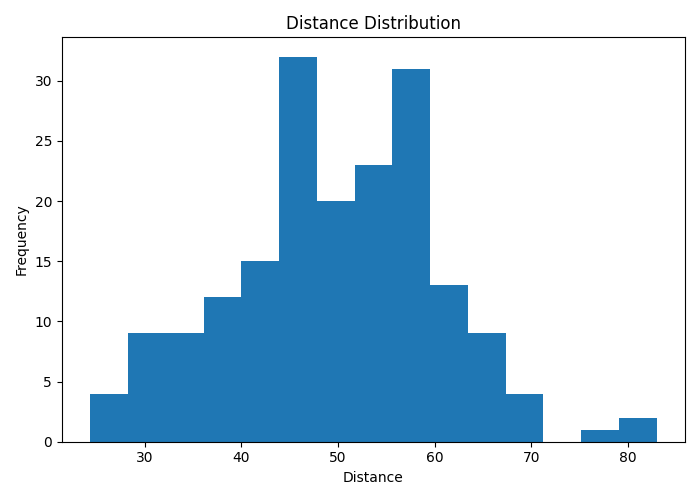
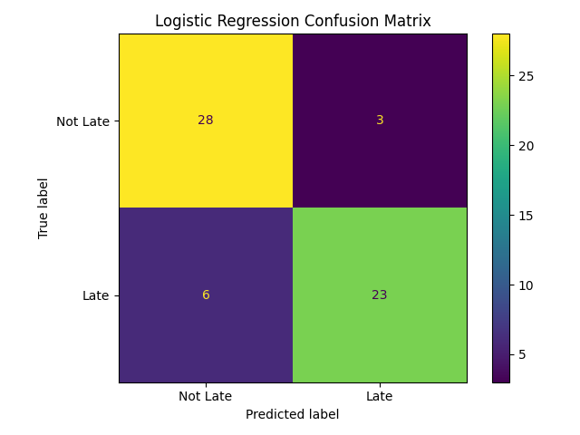
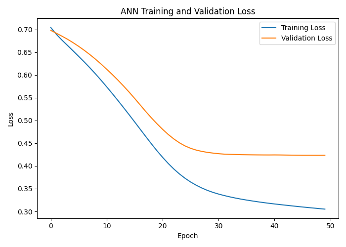
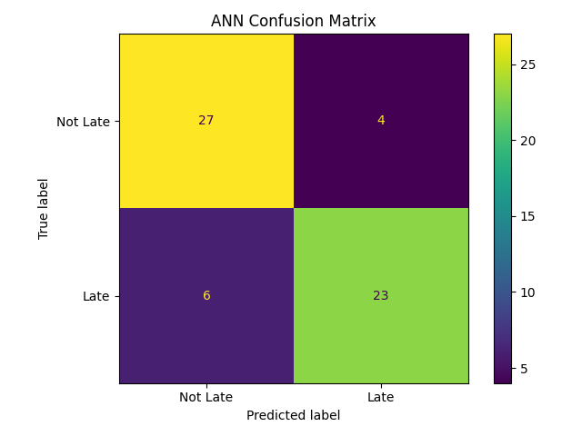

<div align="center">

# 🚚 Late-Delivery Prediction & Operational Segments

### Data Science & AI/ML — Final Practical Exam (Set C)


| 👤 Student | 🆔 Student ID | 📝 Set |
|:---:|:---:|:---:|
| **Maitrak Kunjadiya** | **10015** | **C** |

</div>

---

## 📑 Table of Contents
1. [Objective](#-objective)
2. [Results at a Glance](#-results-at-a-glance)
3. [Dataset & Data Dictionary](#-dataset--data-dictionary)
4. [Cleaning, Features & Split](#-cleaning-features--split)
5. [Task 1 — Maths & Statistics](#-task-1--maths--advanced-statistics)
6. [Task 2 — Preprocessing & Leakage Control](#-task-2--preprocessing--leakage-control)
7. [Task 3 — Supervised Learning](#-task-3--supervised-learning)
8. [Task 4 — Unsupervised Learning](#-task-4--unsupervised-learning)
9. [Task 5 — ANN](#-task-5--deep-learning-ann)
10. [Final Model Comparison](#-final-model-comparison)
11. [Key Findings & Recommendation](#-key-findings--recommendation)
12. [Folder Structure](#-folder-structure)
13. [Setup & How to Run](#-setup--how-to-run)
14. [Reconciliation](#-reconciliation)
15. [Video, References & Declaration](#-video-references--declaration)

---

## 🎯 Objective

Predict whether a delivery will be **late** (`late = 1`) from operational measurements, and discover **operational segments** in the data.

| Module | Goal |
|---|---|
| 📐 Maths & Stats | Descriptive stats, Welch t-test, confidence interval, covariance and eigenvalues |
| 🧹 Preprocessing | Audit, deduplicate, split, impute, encode, scale and engineer a feature, with no leakage |
| 🤖 Supervised | Baseline vs Logistic Regression |
| 🧩 Unsupervised | K-Means segmentation with k = 2, 3, 4 |
| 🧠 Deep Learning | Dense ANN (16 → 8 → 1) with early stopping |

> ⚠️ All data is **synthetic practice data**. Nothing here implies causation or deployment readiness.

---

## 🏆 Results at a Glance

| 🔢 Metric | Value |
|---|:---:|
| Unique records after cleaning | **300** |
| Fit / Validation / Test | **192 / 48 / 60** |
| Baseline accuracy (majority class) | **51.7%** |
| Logistic Regression: accuracy / F1 | **85.0% / 0.836** |
| ANN: accuracy / F1 | **83.3% / 0.821** |
| Best K-Means k (silhouette) | **2** (0.246) |
| ANN trainable parameters | **273** |

---

## 📦 Dataset & Data Dictionary

Generated by `src/generate_data.py` (supplied, **unchanged**), which writes `data/raw/set_b.csv`.

| Column | Type | Description |
|---|---|---|
| `record_id` | Identifier | Unique ID. **Excluded from every model** |
| `distance` | Numeric | Synthetic dimensionless index (15 missing) |
| `load` | Numeric | Synthetic dimensionless index (15 missing) |
| `traffic` | Numeric | Synthetic dimensionless index |
| `staff` | Numeric | Synthetic dimensionless index |
| `group` | Categorical | Operational cohort: `G1` / `G2` |
| `late` | Binary target | `1` = late, `0` = not late |

**Raw audit:** 305 rows × 7 columns · 5 exact duplicates · 15 missing in `distance` and 15 in `load` · target 156 not late / 149 late.

---

## 🧼 Cleaning, Features & Split

| Step | Rule |
|---|---|
| Raw file | Kept unchanged in `data/raw/` |
| Duplicates | Removed before splitting → **300 unique records** |
| Train/Test | 80/20 stratified, `random_state=42` → 240 / 60 |
| Fit/Validation | 80/20 of train, stratified, `random_state=42` → **192 / 48** |
| Imputation | Median, fitted on fit data only |
| Encoding | One-hot `group` (`handle_unknown="ignore"`) |
| Engineered feature | `engineered_feature = load / (staff + 1)`, computed after imputation, on original scale, before scaling |
| Scaling | `StandardScaler` fitted on the 5 numeric fit features only; one-hot columns stay unscaled |
| Seeds | `42` everywhere (NumPy generator seed `202` for data creation) |

**Final feature vector (7):** `distance, load, traffic, staff, engineered_feature, group_G1, group_G2`

---

## 📐 Task 1 — Maths & Advanced Statistics

*Uses the 192 fit records. Observed (non-imputed) values only.*

### M1 — Descriptive statistics for `distance`

| n (observed) | Mean | Median | Std (ddof=1) |
|:---:|:---:|:---:|:---:|
| **184** | **49.74** | **50.20** | **10.84** |

<div align="center">

<br><sub>Distribution of <code>distance</code> in the fit partition</sub>
</div>

### M2 — Statistical inference

**Welch t-test** (two-sided, α = 0.05)
- **H₀:** mean distance of G1 = mean distance of G2
- **H₁:** mean distance of G1 ≠ mean distance of G2

| G1 n | G2 n | t-statistic | p-value | Decision |
|:---:|:---:|:---:|:---:|:---:|
| 104 | 80 | 0.706 | 0.481 | **Fail to reject H₀** |

**95% t-confidence interval for the mean distance:** **[48.17, 51.32]**

> 💡 **Interpretation:** There is no evidence of a difference in mean distance between G1 and G2 (p = 0.481). We are 95% confident the population mean distance lies between 48.17 and 51.32. This describes association in a synthetic sample, not causation.
>
> **Assumptions:** observations are independent; distance is approximately normal (reasonable here, n = 184, with a roughly symmetric histogram).

### M3 — Linear algebra (`distance` & `traffic`)

Using 184 complete rows, centred manually, with covariance `Xcᵀ·Xc / (n−1)`:

```
Covariance matrix = [[ 117.42   -1.24 ]
                     [  -1.24  107.43 ]]
```

| Largest eigenvalue | Variance share | Principal direction |
|:---:|:---:|:---:|
| **117.57** | **52.29%** | `[-0.993, 0.121]` |

> 💡 The first principal direction points almost entirely along `distance`. The off-diagonal covariance is near zero, so the two features are nearly uncorrelated. That is why the variance is split roughly evenly (about 52% / 48%) rather than concentrated in one direction.

---

## 🛡️ Task 2 — Preprocessing & Leakage Control

| Check | Result |
|---|:---:|
| Fit / Val / Test shapes | (192, 7) / (48, 7) / (60, 7) |
| All values finite | ✅ |
| Partitions disjoint (Fit∩Val, Fit∩Test, Val∩Test) | ✅ 0 / 0 / 0 |
| Split IDs saved | `outputs/splits.csv` |

**Why these are excluded from training**
- 🎯 **Target (`late`):** it is the answer. Using it as an input would make the model look perfect while learning nothing real.
- 🆔 **`record_id`:** an arbitrary label with no predictive meaning; the model could memorise it.
- 🧪 **Test statistics:** imputer, encoder and scaler are fitted on the 192 fit rows only and then *reused* on validation and test. The holdout therefore stays truly unseen.

---

## 🤖 Task 3 — Supervised Learning

**Target:** `late` · **Predictors:** the 7 transformed features · **Threshold:** 0.5
**Models:** `DummyClassifier(strategy="most_frequent")` and `LogisticRegression(max_iter=1000, random_state=42)`, both fitted on the same 192 fit rows.
Undefined precision/recall (no positive predictions) is handled with `zero_division=0`. For the dummy baseline they are reported as N/A.

### Test-set results (60 untouched records)

| Model | Accuracy | Precision | Recall | F1 |
|---|:---:|:---:|:---:|:---:|
| Dummy (majority) | 0.517 | N/A | N/A | N/A |
| **Logistic Regression** | **0.850** | **0.885** | **0.793** | **0.836** |

<div align="center">

<br><sub>Logistic Regression confusion matrix: TN = 28, FP = 3, FN = 6, TP = 23</sub>
</div>

> 💡 **Interpretation**
> - **False positive** = a delivery flagged late that arrives on time → wasted escalation effort or resources.
> - **False negative** = a late delivery that goes unflagged → missed intervention and an unhappy customer. In logistics this is usually the costlier error.
> - Logistic Regression beats the baseline by about **33 percentage points** in accuracy, so it offers a real improvement. But recall is 79%, meaning roughly **6 of 29 late deliveries are missed**. With only 60 test records, these numbers carry wide uncertainty.

---

## 🧩 Task 4 — Unsupervised Learning

K-Means on the 5 scaled numeric fit features (`distance, load, traffic, staff, engineered_feature`). No group dummies, target or ID are used, and test data is never touched. Settings: `n_init=10`, `random_state=42`.

| k | Inertia | Silhouette |
|:---:|:---:|:---:|
| **2** ✅ | 719.63 | **0.246** |
| 3 | 599.66 | 0.207 |
| 4 | 535.38 | 0.190 |

**Chosen k = 2** — highest silhouette (ties would go to the smaller k). Inertia always falls as k grows, so it cannot be used alone to choose k.

### Cluster profiles (original scale)

| Cluster | Size | Distance | Load | Traffic | Staff | Load/Staff |
|:---:|:---:|:---:|:---:|:---:|:---:|:---:|
| 0 | 134 | 48.4 | 47.1 | 49.1 | 54.0 | 0.86 |
| 1 | 58 | 52.9 | 57.5 | 49.9 | 41.4 | 1.37 |

| Segment | Name | Suggested action |
|---|---|---|
| Cluster 0 | 🟢 **Well-Staffed, Light-Load** | Keep the current staffing level; monitor routinely. |
| Cluster 1 | 🔴 **Stretched Capacity (High Load, Low Staff)** | Add staff or rebalance loads on these routes before peak periods. |

> ⚠️ Cluster IDs (0/1) are **arbitrary labels**. They do not correspond to the target classes `late = 0/1`. A silhouette of 0.246 also indicates **weak** cluster separation, so treat these as exploratory segments, not hard categories.

---

## 🧠 Task 5 — Deep Learning (ANN)

### Architecture

```
Input (7) → Dense(16, ReLU) → Dense(8, ReLU) → Dense(1, Sigmoid)
```

| Setting | Value |
|---|---|
| Trainable parameters | **273** (128 + 136 + 9) |
| Loss | Binary cross-entropy |
| Optimizer | Adam, learning rate 0.001 |
| Batch size / max epochs | 16 / 50 |
| Early stopping | Monitor `val_loss`, patience 5, `restore_best_weights=True` |
| Validation | Reserved 48 records |
| Random seed | 42 |
| **Actual epochs run** | **50** |

**Why sigmoid + binary cross-entropy?** The task is binary classification. The sigmoid squashes the output to a probability in (0, 1), and binary cross-entropy is the matching loss for probabilistic binary targets.

<div align="center">

<br><sub>Training vs validation loss per epoch</sub>
</div>

> 💡 **Learning-curve discussion:** Both losses fall steadily and the validation loss levels off near **0.42** while training loss keeps drifting down to about **0.31**. This small, stable gap suggests mild overfitting at most, with no sign of underfitting. Early stopping did not trigger before epoch 50 because validation loss never rose for 5 consecutive epochs.

### ANN test results

<div align="center">

<br><sub>ANN confusion matrix on the same 60 test records</sub>
</div>

---

## ⚖️ Final Model Comparison

Evaluated **once** on the same 60 held-out records (threshold 0.5):

| Model | Accuracy | Precision | Recall | F1 |
|---|:---:|:---:|:---:|:---:|
| Dummy (majority) | 0.517 | N/A | N/A | N/A |
| 🥇 **Logistic Regression** | **0.850** | **0.885** | 0.793 | **0.836** |
| ANN (16-8-1) | 0.833 | 0.852 | 0.793 | 0.821 |

> 🏁 **Preferred model: Logistic Regression.** It scores slightly higher F1 (0.836 vs 0.821), is simpler, faster and easier to interpret, and the ANN gives no meaningful gain. The F1 gap is about one test record, well within noise for a 60-row holdout.

---

## 🔑 Key Findings & Recommendation

**📌 Two numerical findings**
1. Logistic Regression reached **85.0% accuracy and F1 = 0.836** on the test set, compared with **51.7%** for the majority-class baseline.
2. K-Means found **two segments**; the smaller one (58 of 192 records) has a **load-to-staff ratio of 1.37 vs 0.86**, marking a high-load, low-staff group.

**✅ Recommendation:** Use Logistic Regression to flag at-risk deliveries, and prioritise staffing support for the stretched-capacity segment.

**⚠️ Limitation:** Results come from synthetic data and a single 60-record holdout, so the metrics carry substantial uncertainty. This is not evidence of deployment readiness.

---

## 🗂️ Folder Structure

```
ds-aiml-set-b-10015/
├── README.md
├── requirements.txt
├── .gitignore
├── src/
│   └── generate_data.py          # supplied generator (unchanged)
├── data/
│   └── raw/
│       └── set_b.csv             # raw data (305 rows, duplicates + missing kept)
├── Notebook/
│   └── Exam.ipynb                # executed notebook, all five modules
├── outputs/
│   ├── splits.csv                # record_id → fit / validation / test
│   ├── statistics_summary.csv    # M1–M3 results
│   ├── preprocessing_features.csv
│   ├── model_comparison.csv      # baseline / logistic / ANN metrics
│   ├── logistic_predictions.csv
│   ├── ann_predictions.csv
│   ├── kmeans_scores.csv
│   ├── cluster_profiles.csv
│   ├── cluster_assignments.csv
│   └── figures/
│       ├── distance_histogram.png
│       ├── logistic_confusion_matrix.png
│       ├── ann_confusion_matrix.png
│       └── ann_loss_curve.png
└── models/
    └── ann_model.keras           # trained ANN
```

---

## 🚀 Setup & How to Run

**Tools:** Python 3.12 · NumPy · pandas · SciPy · scikit-learn · matplotlib · TensorFlow/Keras
**Versions:** see `requirements.txt` (record exact versions with `pip freeze` — e.g. `numpy==…`, `scikit-learn==…`, `tensorflow==…`)

Run everything **from the repository root**:

```bash
# 1. Clone
git clone https://github.com/Maitrak-2661/practical-exam---SET-C-.git
cd ds-aiml-set-b-10015

# 2. Create a virtual environment
python -m venv .venv
# Windows:      .venv\Scripts\activate
# macOS/Linux:  source .venv/bin/activate

# 3. Install dependencies
pip install -r requirements.txt

# 4. Generate the dataset (creates data/raw/set_b.csv)
python src/generate_data.py

# 5. Run the notebook top to bottom (working directory = repo root)
jupyter notebook Notebook/Exam.ipynb
```

**Load the saved ANN:**
```python
from tensorflow.keras.models import load_model
ann = load_model("models/ann_model.keras")
```
Preprocessing (median imputer → engineered feature → scaler + one-hot) is recreated by running the notebook's Section 2 cells on the 192 fit rows.

---

## 🔍 Reconciliation

- ✅ Logistic Regression and ANN were evaluated on the **identical 60 test IDs** (`record_id` matches across `logistic_predictions.csv` and `ann_predictions.csv`).
- ✅ Metrics in `model_comparison.csv` are computed from the saved prediction files.
- ✅ Test set was used **once** per model, with no tuning on test data and no seed selection to improve scores.

---

## 🎬 Video, References & Declaration

| | |
|---|---|
| 📺 **Video URL** | https://drive.google.com/drive/folders/1gfDl_DSENBd-UPjhihfoSHXTJ_Opfthc?usp=drive_link |

**References**
- scikit-learn documentation — https://scikit-learn.org
- TensorFlow/Keras documentation — https://www.tensorflow.org
- SciPy statistics documentation — https://docs.scipy.org
- Supplied data generator and exam paper: Red & White Skill Education, Set C

> ✍️ **Declaration:** All work is my own except where cited.
>
> — *Maitrak Kunjadiya, Student ID 10015*

<div align="center"><sub>⭐ Built for the Data Science & AI/ML Final Practical Exam, Set C</sub></div>
